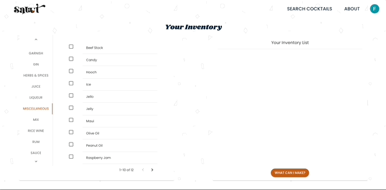
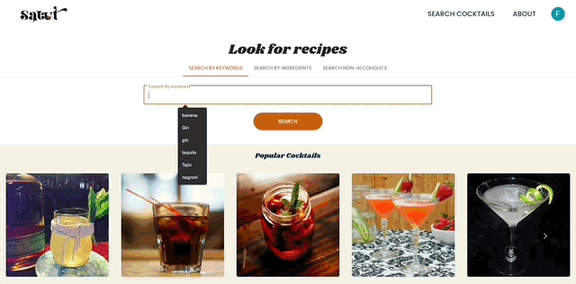
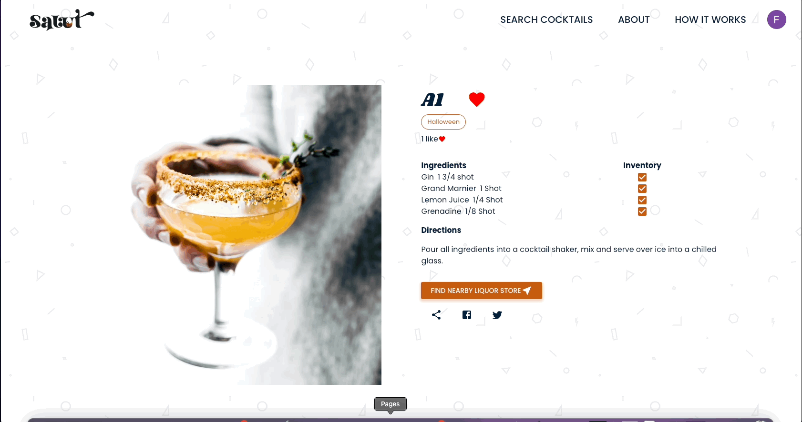

Salut is an interactive cocktail cabinet and your source for cocktail recipes.

- Create your inventory based on the items you have on hand.
- See what cocktails you can make right now and cocktails you can make with your ingredients.
- Search for alcoholic and non-alcoholic recipes based on keywords and ingredients.
- Save as favorite and categorize your cocktails.
- Create your own cocktail recipe.

## Getting Started

1. Install dependencies using the `npm install` command.
2. Create an .env file following the .env sample provided.
3. Run `npx prisma migrate dev` to create the tables.
4. Run `npm run reset` to seed the files to the database.
5. Start the web server by using `npm run dev` on your terminal.
6. Visit http://localhost:3000 to start using the app.

## Usage and Features

### Sign-in and tutorial

Signing-in, the user has the option to use their google account or facebook account to make an account in our website.

Once signed-in for the first time, the user will be redirected to our "Getting Started" page. It will show an overview of what our app does and provides tutorials.

### Searching for Cocktail Recipes:

Searching for recipes, the user can pick three modes:

- Search by keywords
- Search by ingredients
- Search Non-alcoholic drinks

### Setting up inventory:

Ingredients are divided based on their category. The user just has to select the ingredient that they have to their inventory.

Clicking `What can I make?` will display the cocktails you can make right now based on your inventory.

### Creating a recipe:

A user can also create their own recipes and add it to their favorite list.

After creating the recipe, the user will be redirected to their "Created recipes" page to manage the recipes.

### Adding cocktails as favorite and categorizing.

As a logged in user: When searching for a recipe, heart icons will appear on the top right screen of each cocktail cards. Clicking the icons will set it as favorite that will be shown on the user's favorite page.

In the Favorite page, the user can also create/delete categories and categorize the cocktails accordingly.

### Looking at the drink details

Clicking the drink card will show the details of the chosen drink.

It displays the following:

- Name of the drink
- Status (if set as favorite or not)
- Category (if any) the beverage belongs to
- How many likes the drink has
- Ingredients and status if ingredient is in the inventory
- Share to twitter, facebook, and copy to clipboard icons.
- Find the closest liquor store and get directions.

## Dependencies

- NodeJS 16.18.1
- NPM 8.19.2
- NextJS 13.1.1
- ReactJS 18.2.0
- React Carousel 3.4.2
- Google Maps API 2.17.1
- Googe Maps Services 3.3.26
- MUI 5.11.3
- Next-Auth 4.18.7
- Axios 1.2.2
- Prisma 4.8.1
- SWR 2.0.0
